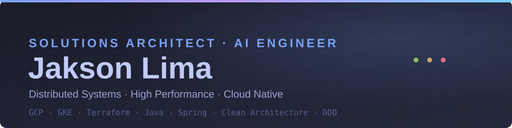
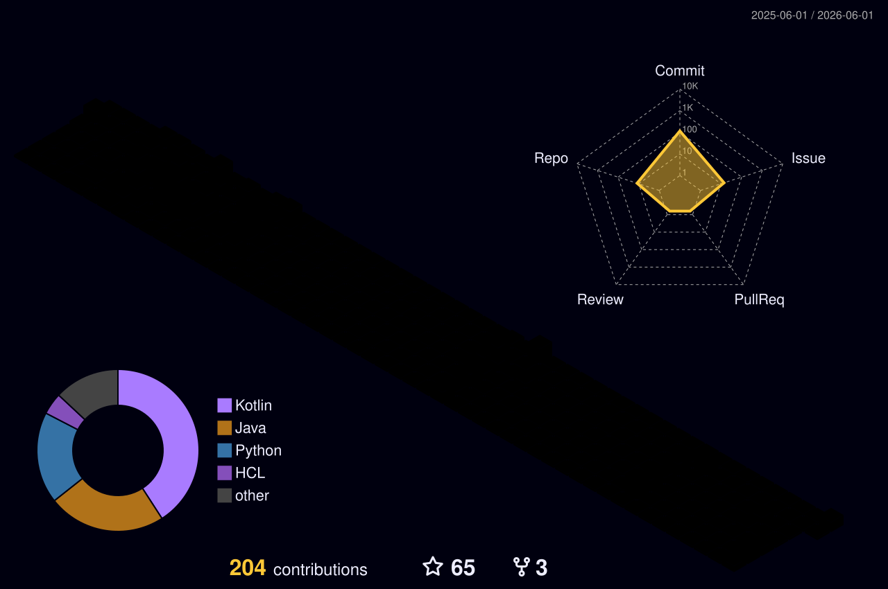

 

---

### Contribution Skyline

---

### GitHub Stats

 

---

### Tech Stack

**Cloud & DevOps**

**Backend & Dados**

**AI Engineering**

**Arquitetura & Práticas**

---

### Formação

- **MBA · Engenharia de Software com IA** — Full Cycle *(2025 — 2026, em andamento)*
- **MBA · Arquitetura de Software e Soluções** — Full Cycle *(2023 — 2025)*
- **Bacharelado · Ciência da Computação** — UNOPAR *(2017 — 2020)*
- **Diploma of Education (Inglês)** — KNN Idiomas *(2021 — 2023)*

---

### Contato

&nbsp;

&nbsp;

