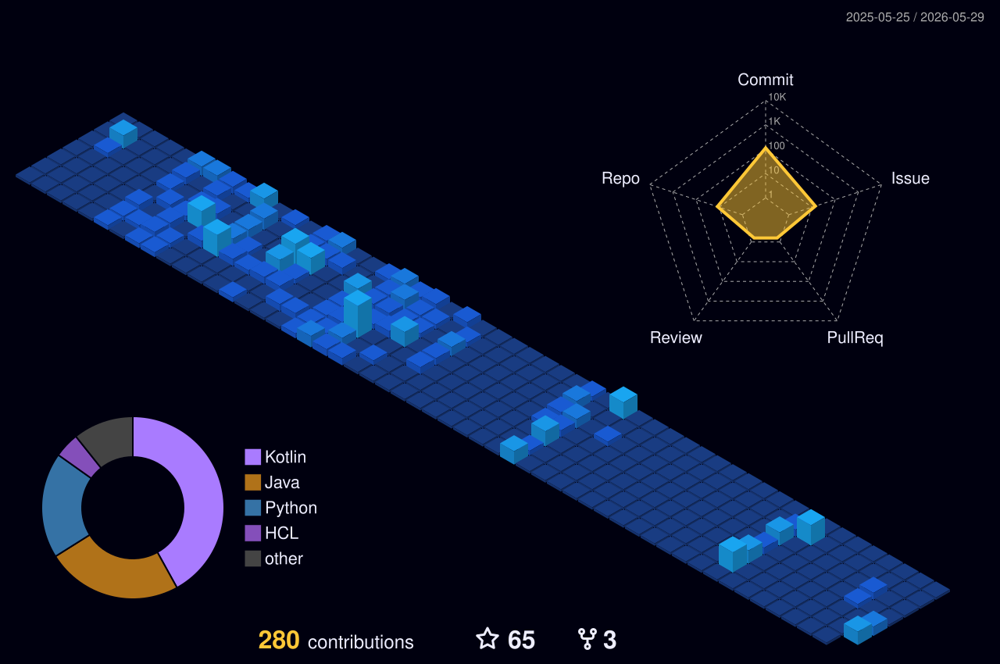

📍 Florianópolis, Santa Catarina, Brasil

---

### `whoami`

**Solutions Architect & AI Engineer** com mais de **10 anos de experiência** e formação em Ciência da Computação. Especialista no desenvolvimento de **sistemas distribuídos de alta performance**, atuando em modelo **Full Cycle** — do backend ao frontend — e liderando a transição de ambientes On-premise para Cloud Providers.

Projeto plataformas guiadas por **Domain-Driven Design**, **Clean Architecture** e **Arquitetura Hexagonal**, rodando cloud-native em **GCP / GKE** com IaC via **Terraform**. Integro **IA** de forma pragmática ao fluxo de engenharia de software.

- Liderança técnica de times e migração de monolitos para microsserviços
- Design de APIs RESTful e event-driven · mensageria em larga escala (Kafka, RabbitMQ)
- Software architecture design com **C4** · observabilidade ponta a ponta

---

### Trajetória

| Período | Empresa | Cargo |
|---|---|---|
| 2026 — atual | **Bullla** | Architect · Solutions & Software |
| 2024 — 2025 | **Nubank** | Senior Software Engineer |
| 2022 — 2024 | **Dasa** | Staff Software Engineer · Tech Lead |
| 2021 — 2023 | **Compass.uol** | Especialista / Desenvolvedor Sênior |
| 2021 | **Philips · AMcom** | Desenvolvedor Sênior |

---

### Tech Stack

**Cloud & DevOps**

**Backend & Dados**

**AI Engineering**

**Arquitetura & Práticas**

---

### GitHub Stats

 

---

### Contribution Skyline

> Modelo isométrico gerado pela [profile-3d-contrib](https://github.com/yoshi389111/github-profile-3d-contrib) via GitHub Action (`.github/workflows/profile-3d.yml`), atualizado diariamente. O SVG é commitado no próprio repositório — renderização determinística, sem depender de serviços externos.

---

### Formação

- **MBA · Engenharia de Software com IA** — Full Cycle *(2025 — 2026, em andamento)*
- **MBA · Arquitetura de Software e Soluções** — Full Cycle *(2023 — 2025)*
- **Bacharelado · Ciência da Computação** — UNOPAR *(2017 — 2020)*
- **Diploma of Education (Inglês)** — KNN Idiomas *(2021 — 2023)*

---

### Contato

